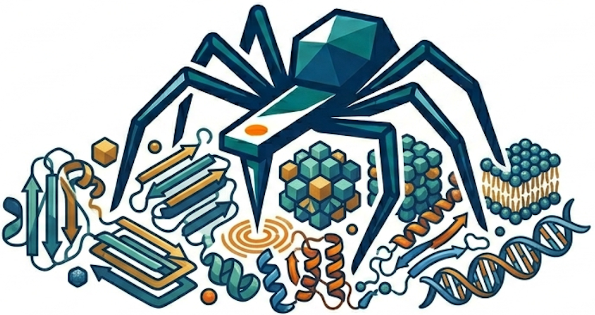
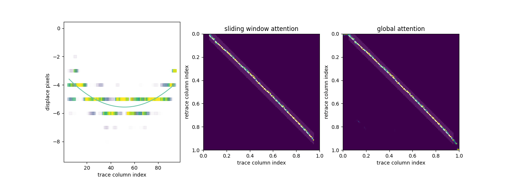

<p>
  <h1 align="center">SPIDER</h1>
  <h3 align="center">Scanning Probe microscopy Image DEnoising and Restoration</h3>
</p>



## 🕷 Introduction
SPIDER is a self-supervised framework for denoising atomic force microscopy (AFM) and other scanning probe microscopy (SPM) images using paired trace and retrace scans<sup>1</sup>. The method utilizes the spatial redundancy of raster-scanning and learns the underlying surface signals while suppressing independent noises  without requiring clean ground-truth images<sup>2</sup>.


## 🛠 Installation
We provide a Google Colab notebook for easy use. [](https://colab.research.google.com/github/psichen/SPIDER/blob/main/SPIDER_colab.ipynb)

### Tested platform
- Rocky Linux 9.1 (256G RAM, NVIDIA TITAN X 12GB)
- Python = 3.9.14
- CUDA = 12.0

### Instructions

1. Clone the repository:
```bash
git clone https://github.com/psichen/SPIDER.git
cd SPIDER
```

2. Set up the environment and package dependencies:
```bash
pip install -r requirements.txt
```

Usually it would take couple of minutes to finish installtion. For typical HS-AFM images (over tens of frames of 300 by 300 pixels), it would take around 5 minutes to perform ensemble denoising results. 

## ⚙️ Dataset preparation
First, hysteresis effect is corrected for AFM trace/retrace images to generate image pairs for self-supervised denoising:

```bash
python preprocess.py [OPTIONS]
```

Some important arguments are listed:

| Argument | Short | Type | Default | Description |
| --- | --- | --- | --- | --- |
| `--raw_path` | `-rp` | str | 'raw' | path to raw images |
| `--trace_file` | `-tf` | str | 'trace.tif' | trace filename |
| `--retrace_file` | `-rf` | str | 'retrace.tif' | retrace filename |
| `--data_path` | `-dp` | str | 'datasets' | path to training datasets |
| `--shift` | `-sf` | float | None | attention area shift |
| `--window` | `-w` | float | .1 | attention window size |
| `--trace_left` | `-tl` | float | .05 | trace left boundary ratio |
| `--trace_right` | `-tr` | float | .95 | trace right boundary ratio |
| `--coef` | `-c` | float[3] | | predefined quadratic coefficients |
| `--plot` | `-p` | flag | | plot results if present |
| `--save` | `-s` | flag | | save results in the `data_path` if present |

The mismatch between trace columns and retrace columns is non-linear<sup>3</sup> and fitted by a quadratic function. The script will give the x- and y-coordiate of the apex of the quadratic curve, representing the linear component of the mismatch. The quadratic parameters will also be given for the non-linear mismatch correction.

Example:
```bash
python preprocess.py \
    -rp ./raw \
    -dp ./datasets \
    -tf trace.tif \
    -rf retrace.tif \
    -sf .04 \
    -p -s \
```
or
```bash
python preprocess.py \
    -c 0.0009050942202696902 -0.0936764923029398 -3.1469189098574337 \
    -p \
```

A successful fitting result would be like


The left panel shows the displacement of retrace columns to the most similar trace columns. The quadratic curve approximates the non-linearity to the 2nd-order of the Taylor series.

Because the hysteresis effect is localized, *i.e.*, the trace columns and the retrace columns corresponding to the same scanned region are restricted in a limited range in the formed image. The middle panel shows the attention distribution between trace and retrace when the locality is considered.

The right panel shows the global attention distribution. When images experience an extremely low signal-to-noise ratio (SNR), the fitting process from gloal attention might be affected by the broad attention spread resulting from self-similar noises.

Corrected trace/retrace image pairs at sub-pixel level will be saved in the `data_path` for the following self-supervised training.

## 💻 Training
The model is trained by minimizing the self-supervised loss, *e.g.*, when the raw trace $T$ is denoised based on raw retrace $R$,

```math
L_{r2t} = \mathbb{E} \Vert f_\theta(T) - R \Vert ^2
```

Because $f_\theta$ is $\mathcal{J}$-invariant<sup>4</sup>, the difference between the function output and the clean retrace $f_\theta(T) - R_0$ is independent from the retrace noise $R-R_0$, so $L_{r2t}$ becomes,

```math
L_{r2t} = \mathbb{E} \Vert f_\theta(T) - R_0 \Vert ^2 + \mathbb{E} \Vert R - R_0 \Vert ^2
```

For a given dataset with constant noise variance, one may find the optimal denoising function $f_\theta$ by minimizing the self-supervised loss.

The training script will train two models separately to denoise trace based on retrace (*r2t*) and denoise retrace based on trace (*t2r*), respectively.

```bash
python trainer_ddp.py [OPTIONS]
```
SPIDER supports multi-GPU training using PyTorch Distributed Data Parallel (DDP).

Some important arguments are listed:

| Argument | Short | Type | Default | Description |
| --- | --- | --- | --- | --- |
| `--data_path` | `-dp` | str | 'datasets' | path to training datasets |
| `--checkpoint_path` | `-cp` | str | 'checkpoints' | path to checkpoints |
| `--batch_size` | `-b` | int | 512 | number of images processed per iteration |
| `--epochs` | `-e` | int | None | total number of training epochs |
| `--iteration` | `-it` | int | 200 | total number of training iterations |
| `--augmentation` | `-a` | flag | | perform data augmentation if present |
| `--patch_size` | `-ps` | int[1 or 2] | 64 | image patch size for training |
| `--ensembles` | `-n` | int | 3 | number of emsemble learnings |
| `--world_size` | `-ws` | int | available GPUs | number of GPUs |

The training script will generate `hyperparams.txt`, `.pth` checkpoint, updated learning rates and loss values in the `checkpoint_path`.

### Augmentation

### Ensemble learning

## 💡 Prediction & Postprocessing

```bash
python predictor_ddp.py [OPTIONS]
python postprocess.py
```

Some important arguments are listed:

| Argument | Short | Type | Default | Description |
| --- | --- | --- | --- | --- |
| `--data_path` | `-dp` | str | 'datasets' | path to training datasets |
| `--checkpoint_path` | `-cp` | str | 'checkpoints' | path to checkpoints |
| `--prediction_path` | `-pp` | str | 'predictions' | path to predictions |
| `--batch_size` | `-b` | int | 512 | number of images processed per iteration |
| `--patch_size` | `-ps` | int[1 or 2] | 64 | image patch size for training |
| `--world_size` | `-ws` | int | available GPUs | number of GPUs |

### Pixelization

### 3D pointcloud

## 🌀 Equivariant restoration
Because samples are generally distributed randomly on the substrate, the underlying structures are expected to exhibit identical spatial information in both the fast- and slow-scan axes. However, the distinct noise characteristics of the two axes and the raster-scanning process break this symmetry in spatial resolution. SPIDER suppresses structural noises and leverages the recovered information in the fast-scan axis to reconstruct the spatial information in the slow-scan axis, thereby enabling self-supervised restoration and enhancement of the slow-scan resolution.

```bash
python equivariant/trainer_ddp.py [OPTIONS]
python equivariant/predictor_ddp.py [OPTIONS]
```

Some important arguments are listed:

For `equivariant/trainer_ddp.py`:
| Argument | Short | Type | Default | Description |
| --- | --- | --- | --- | --- |
| `--data_path` | `-dp` | str | 'datasets' | path to training datasets |
| `--checkpoint_path` | `-cp` | str | 'checkpoints' | path to checkpoints |
| `--batch_size` | `-b` | int | 512 | number of images processed per iteration |
| `--epochs` | `-e` | int | None | total number of training epochs |
| `--iteration` | `-it` | int | 200 | total number of training iterations |
| `--augmentation` | `-a` | flag | | perform data augmentation if present |
| `--patch_size` | `-ps` | int[1 or 2] | 64 | image patch size for training |
| `--scale_factor` | `-s` | int | 3 | scale factor in the slow-scan axis |
| `--loss_weight` | `-w` | float | .9 | weight between consistency loss and equivariance loss |
| `--world_size` | `-ws` | int | available GPUs | number of GPUs |

For `equivariant/predictor_ddp.py`:
| Argument | Short | Type | Default | Description |
| --- | --- | --- | --- | --- |
| `--data_path` | `-dp` | str | 'datasets' | path to training datasets |
| `--checkpoint_path` | `-cp` | str | 'checkpoints' | path to checkpoints |
| `--prediction_path` | `-pp` | str | 'predictions' | path to predictions |
| `--batch_size` | `-b` | int | 512 | number of images processed per iteration |
| `--patch_size` | `-ps` | int[1 or 2] | 64 | image patch size for training |
| `--scale_factor` | `-s` | int | 3 | scale factor in the slow-scan axis |
| `--world_size` | `-ws` | int | available GPUs | number of GPUs |

## 🔖 Reference

1. Sichen Pan, Simon Scheuring. "Self-supervised denoising and restoration method for atomic force microscopy" In review (2026)
2. Lehtinen, Jaakko, et al. "Noise2Noise: Learning image restoration without clean data." arXiv preprint arXiv:1803.04189 (2018).
3. Kubo, Shintaroh, et al. "Removing the parachuting artifact using two-way scanning data in high-speed atomic force microscopy." Biophysics and physicobiology 20.1 (2023): e200006.
4. Batson, Joshua, and Loic Royer. "Noise2self: Blind denoising by self-supervision." International conference on machine learning. PMLR, 2019.

---
SPIDER is released under the Apache License, Version 2.0 (see LICENSE file).